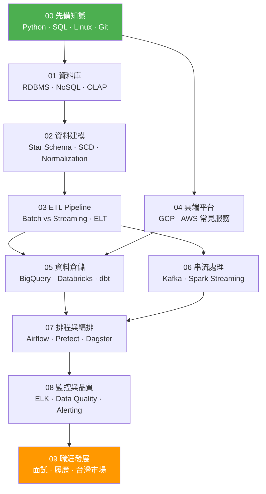

# 數據工程師學習路線 Data Engineering Roadmap

> 一份以台灣實務為導向的數據工程師養成指南，從零基礎到業界即戰力。

## 這份路線圖適合誰？

- 有 Python / SQL 基礎，想轉職數據工程師的人
- 剛入行的 Junior DE，想補齊知識體系
- 對數據工程有興趣，想了解這個領域在做什麼的人

## 路線總覽

## 章節目錄

| 章節 | 主題 | 難度 | 狀態 |
|------|------|------|------|
| [00 - 先備知識](./00-prerequisites/) | Python, SQL, Linux, Git | ⭐ | 🚧 |
| [01 - 資料庫](./01-databases/) | RDBMS, NoSQL, OLAP | ⭐⭐ | 🚧 |
| [02 - 資料建模](./02-data-modeling/) | Star Schema, SCD, Normalization | ⭐⭐ | 🚧 |
| [03 - ETL Pipeline](./03-etl-pipelines/) | Batch, Streaming, ELT 模式 | ⭐⭐⭐ | 🚧 |
| [04 - 雲端平台](./04-cloud-platforms/) | GCP, AWS 常見服務 | ⭐⭐ | 🚧 |
| [05 - 資料倉儲](./05-data-warehousing/) | BigQuery, Databricks, dbt | ⭐⭐⭐ | 🚧 |
| [06 - 串流處理](./06-streaming/) | Kafka, Spark Streaming | ⭐⭐⭐ | 🚧 |
| [07 - 排程與編排](./07-orchestration/) | Airflow, Prefect, Dagster | ⭐⭐ | 🚧 |
| [08 - 監控與品質](./08-monitoring/) | ELK, Data Quality, Alerting | ⭐⭐ | 🚧 |
| [09 - 職涯發展](./09-career/) | 面試準備, 履歷, 台灣市場 | ⭐ | 🚧 |

> ⭐ 入門 · ⭐⭐ 中階 · ⭐⭐⭐ 進階

## 學習建議

### 必學（先掌握這些再往下走）
- Python 基礎 + SQL 查詢與效能調校
- 至少一種 RDBMS（PostgreSQL 推薦）
- ETL 的基本概念與實作
- Git 版本控制

### 加分（求職加分，工作中常用）
- 雲端平台操作經驗（GCP 或 AWS）
- Airflow 排程管理
- Docker 容器化基礎
- 資料建模觀念

### 進階（Senior DE 的武器）
- Spark 大規模資料處理
- Kafka 即時串流
- Data Quality Framework
- 系統架構設計

## 關於作者

實務經驗來自台灣博弈與金融產業的數據工程工作，技術棧涵蓋 Databricks、GCP、ClickHouse、Django、ELK 等。

## 授權

[MIT License](./LICENSE)
